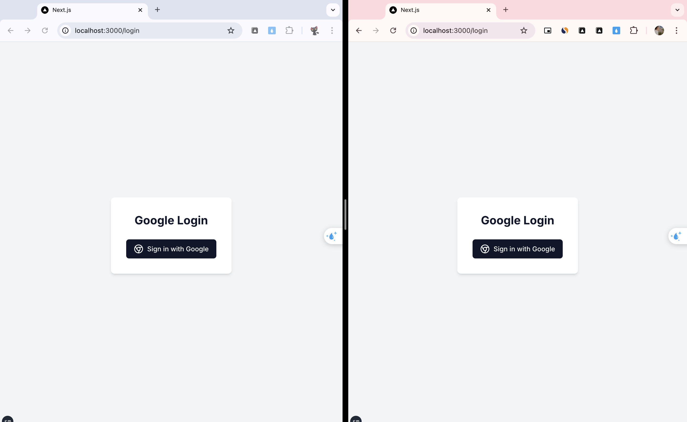
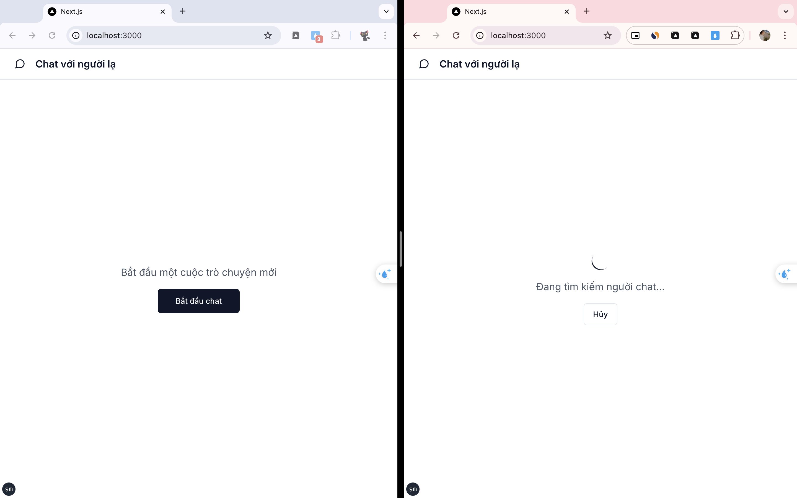
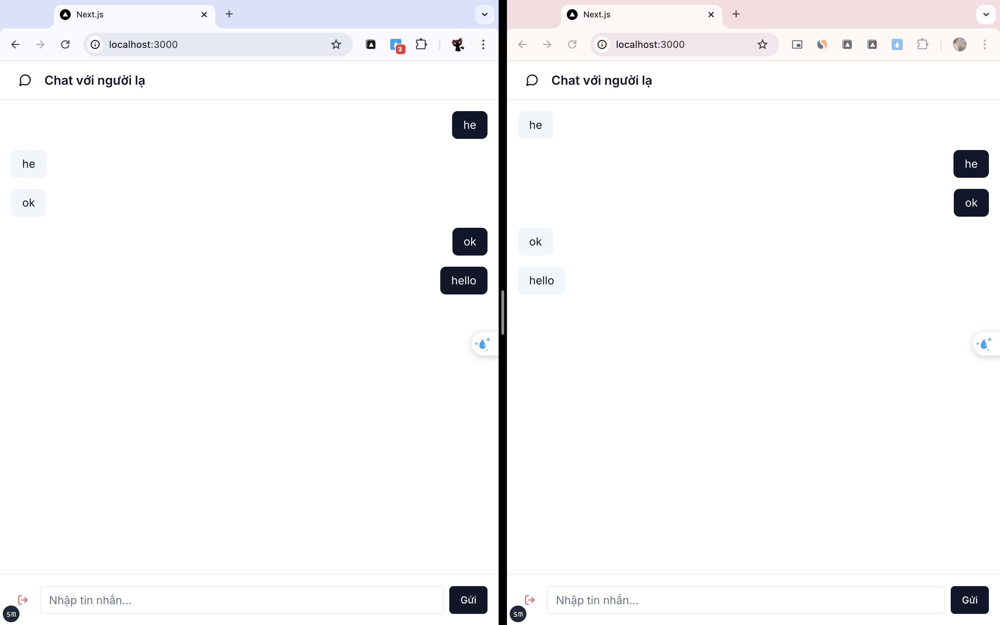

# Simple Chat App with Next.js and Socket.io & Firebase

Ứng dụng chat đơn giản được xây dựng bằng Next.js 14 và Socket.io & Firebase, cho phép người dùng đăng nhập và trò chuyện realtime.

## Demo


## Screenshots


*Màn hình đăng nhập với Google*


*Giao diện tìm kiếm người chat*


*Giao diện chat chính*
## Tính năng chính

- 🔐 Xác thực với Google thông qua Firebase Auth
- 💬 Chat realtime 
- 🎨 Giao diện người dùng thân thiện với Tailwind CSS
- 📱 Responsive trên mọi thiết bị
- 🚀 Server-side rendering với Next.js 14

## Công nghệ sử dụng

- Next.js 14
- Firebase (Authentication, Firestore)
- Tailwind CSS
- TypeScript

## Backend Environment Setup

1. Copy `.env.example` to `.env`:
```bash
cp .env.example .env
```

2. Nội dung file `.env.example`:
```plaintext
PORT=3001
FRONTEND_URL=http://localhost:3000
FIREBASE_DATABASE_URL=your_firebase_database_url
```

3. Copy `cert.example.json` to `cert.json`:
```bash
cp cert.example.json cert.json
```

4. Nội dung file `cert.example.json`:
```json
{
  "type": "service_account",
  "project_id": "your_project_id",
  "private_key_id": "your_private_key_id",
  "private_key": "your_private_key",
  "client_email": "your_client_email",
  "client_id": "your_client_id",
  "auth_uri": "https://accounts.google.com/o/oauth2/auth",
  "token_uri": "https://oauth2.googleapis.com/token",
  "auth_provider_x509_cert_url": "https://www.googleapis.com/oauth2/v1/certs",
  "client_x509_cert_url": "your_client_x509_cert_url",
  "universe_domain": "googleapis.com"
}
```

5. Cập nhật các giá trị trong `.env` và `cert.json` với thông tin Firebase của bạn

## Frontend Environment Setup

1. Copy `.env.local.example` to `.env.local`:
```bash
cp .env.local.example .env.local
```

2. Update các giá trị trong `.env.local` với Firebase configuration của bạn
